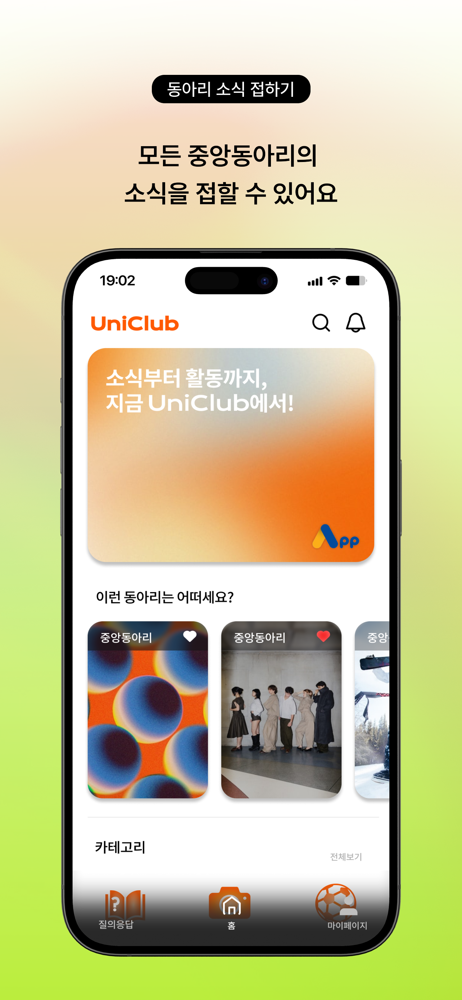
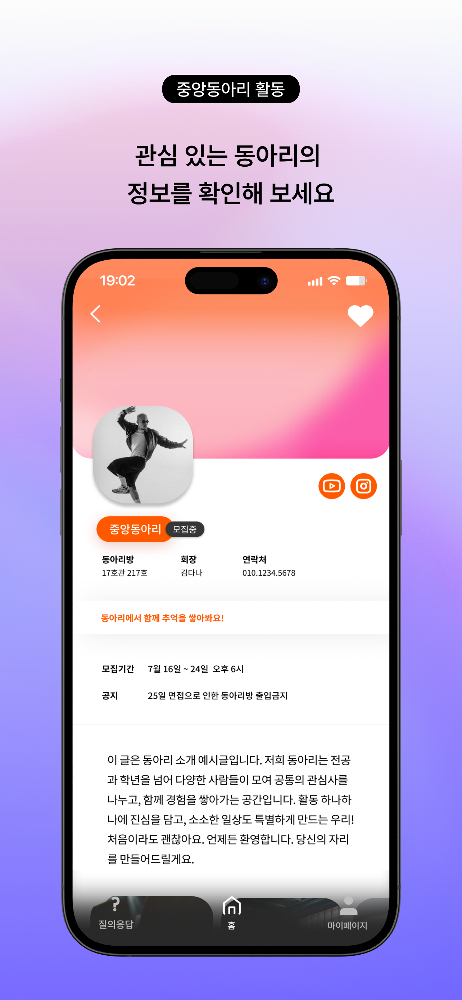
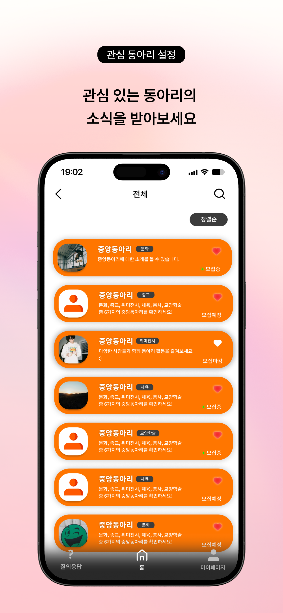
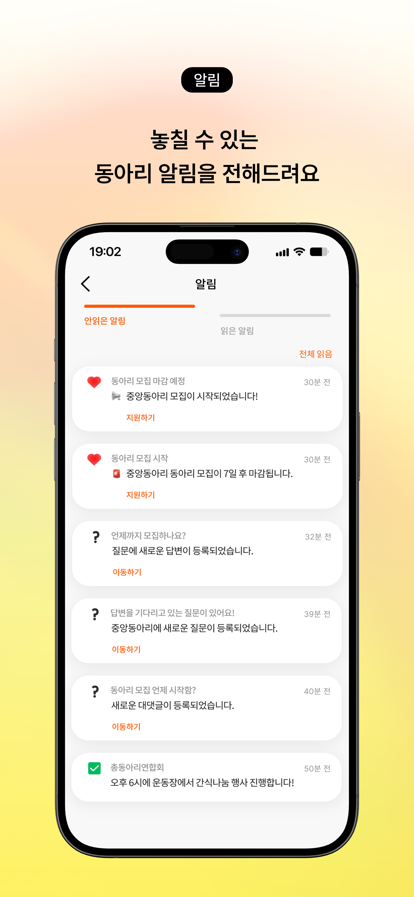
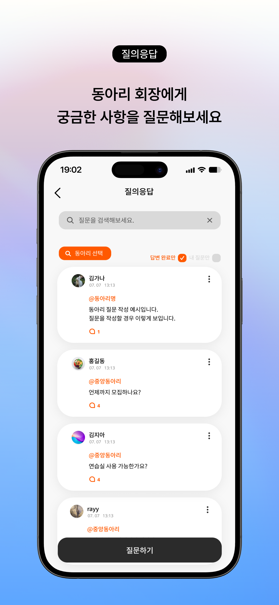
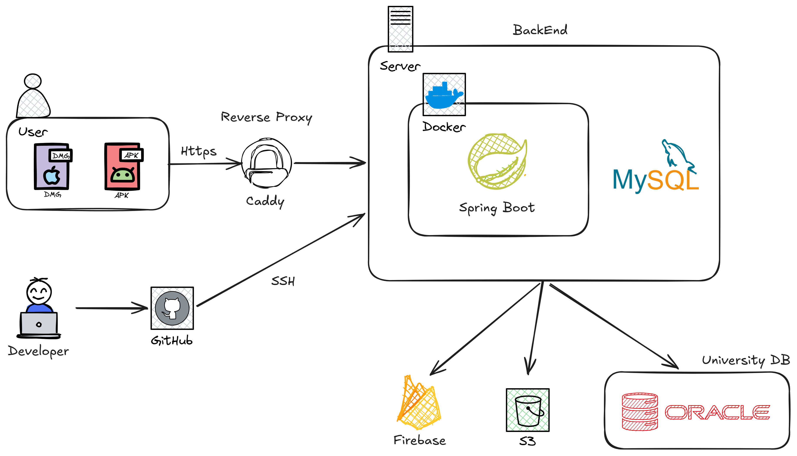

<div align="center">


# UniClub

**인천대학교 공식 중앙동아리 통합 플랫폼**

> 동아리를 찾고, 소통하고, 참여하며 더 풍부한 대학생활을 누릴 수 있도록

[](https://hits.seeyoufarm.com)

</div>

---

## 📌 프로젝트 소개

인천대학교 학생들이 동아리를 탐색하고, 운영진과 소통하며, 관심 동아리의 소식을 받아볼 수 있는 **인천대학교 전용 동아리 통합 플랫폼**입니다.

기존에는 동아리 정보가 분산되어 있어 원하는 동아리를 찾거나 문의하기가 어려웠습니다.  
UniClub은 이 문제를 해결하기 위해, 모든 중앙동아리 정보를 한 곳에서 관리하고 제공합니다.

---

## 📱 서비스 화면

<p align="left">
  
</p>
<p align="left">
  
  
  
  
  
</p>

---

## 🎯 주요 기능

### 🔍 동아리 탐색
- 문화 · 종교 · 취미전시 · 체육 · 봉사 · 교양학술 카테고리별 동아리 목록 제공
- 동아리 소개, 활동 사진·영상, 모집 공지 제공
- 동아리 운영진이 직접 등록·수정하는 최신 정보 반영

### 💬 Q&A (질의응답)
- 동아리별 질문 게시판 제공
- 실명 / 닉네임 선택 가능
- 운영진 답변 완료 여부 표시

### 🔔 알림
- 즐겨찾기한 동아리의 모집 시작 / 마감 임박 알림
- Q&A 답변 등록 알림
- FCM 기반 푸시 알림으로 중요 소식을 실시간 전달

### 🏠 맞춤형 홈 화면
- 배너를 통한 동아리 활동 소개 및 이벤트 안내
- 즐겨찾기한 동아리의 최신 공지 확인
- 지금 모집 중인 동아리 우선 노출

### 👤 마이페이지
- 닉네임, 전공, 프로필 이미지 관리
- 알림 설정 및 계정 관리

---

## 🏗 시스템 아키텍처



---

## ⚙️ 핵심 기술 설계

### 1️⃣ 다중 데이터소스 분리 설계 (MySQL + Oracle)

인천대학교 학생 인증을 위해 교내 Oracle DB와 서비스용 MySQL을 분리하여 운영합니다.

- `@Primary` DataSource: MySQL (서비스 데이터)
- Secondary DataSource: Oracle (학생 인증 전용)
- Spring의 `AbstractRoutingDataSource`를 활용한 동적 라우팅

✔ 외부 인증 시스템과 서비스 DB 간 결합도 최소화  
✔ 인증 로직 장애가 서비스 전체에 영향을 주지 않는 구조 확보

---

### 2️⃣ Firebase 기반 푸시 알림

Firebase Admin SDK를 활용하여 모집 알림, Q&A 답변 알림 등을 FCM으로 발송합니다.

- 즐겨찾기 기반 타겟 알림 전송
- 모집 시작 / 마감 임박 시점 자동 알림 (스케줄러 연동)
- 알림 유형별 분기 처리

✔ 불필요한 Polling 제거  
✔ 사용자가 앱을 열지 않아도 중요 정보 전달

---

### 3️⃣ S3 Presigned URL을 활용한 파일 업로드

클라이언트가 서버를 거치지 않고 S3에 직접 업로드하는 구조를 채택했습니다.

- 서버는 Presigned URL만 발급
- 클라이언트는 해당 URL로 S3에 직접 PUT 요청
- 업로드 완료 후 서버에 URL 저장 요청

✔ 대용량 파일 업로드 시 백엔드 서버 부하 제거  
✔ 서버 메모리/네트워크 자원 절약

---

## 🛠 기술 스택

| 영역 | 기술 |
|------|------|
| Mobile | iOS (Swift), Android (Kotlin) |
| Backend | Spring Boot |
| Database | MySQL, Oracle DB (학생 인증) |
| Storage | AWS S3 |
| Push Notification | Firebase Cloud Messaging (FCM) |
| Infra | Docker, 자체 서버 (inuappcenter.kr) |

---

## 📁 패키지 구조

```
com.uniclub
├── domain
│   ├── club          # 동아리
│   ├── user          # 사용자
│   ├── question      # Q&A
│   ├── notification  # 알림
│   └── ...
└── global
    ├── config        # 설정
    ├── exception     # 공통 예외
    ├── security      # 인증/인가
    └── ...

```

---

## 📎 관련 링크

- 🍎 App Store: [링크 추가 예정]
- 📄 API 문서: [링크 추가 예정]
